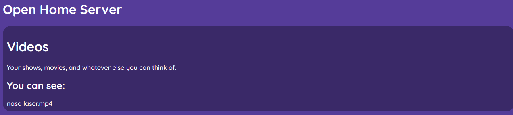

# Open Home Server
You guessed it, it's a home server! This server is like any home server, except made with flask.

To get running with OHS, all you have to do is launch the flask app. Something like this:
```
flask run --host 0.0.0
```

> ### What is `--host 0.0.0`?
>
> That makes Flask listen on all addresses.

# Checklist
- [x] Dedicated videos page (including downloading, and uploads)
- [ ] Renaming on Videos
- [ ] File-storing page
- [x] Get the basics down

# Uploading Videos
You can:
1. Upload from your filesystem
2. Upload from the webUI.
## From your filesystem
Copy your desired video to the [videos folder.](/videos/) On launch/reload, you'll see your video in your server!
## From the webUI
Click the Videos card:


and from the controls, click the upload button.


Select your video, and wait for it to upload. When it reloads, you can now watch it!